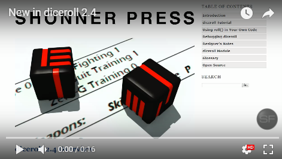

.. image:: docs/source/python_classic_2_5_tag.png
    :target: https://www.python.org/download/releases/2.5.4/
    

    
.. image:: https://readthedocs.org/projects/diceroll/badge/?version=latest
    :target: http://diceroll.readthedocs.io/en/latest/?badge=latest
    :alt: Doc Status

.. figure:: docs/source/diceroll_manual_cover_pdf_art.png

**diceroll 3.1 for Classic Python 2.5**
=======================================

**diceroll 3.1** is a Classic Python 2.5 module that your game code calls to make dice rolls.

Read the **diceroll Operations Manual** at http://diceroll.readthedocs.io

Download the PDF from https://readthedocs.org/projects/diceroll/downloads/pdf/latest

or the EPUB from https://readthedocs.org/projects/diceroll/downloads/epub/latest

Warning
-------

**diceroll** will not work with **Python 2.6+**.

Contact
-------
Questions? Please contact shawndriscoll@hotmail.com

The Traveller game in all forms is owned by Far
Future Enterprises. Copyright 1977 - 2021 Far Future
Enterprises. Traveller is a registered trademark of Far
Future Enterprises.
